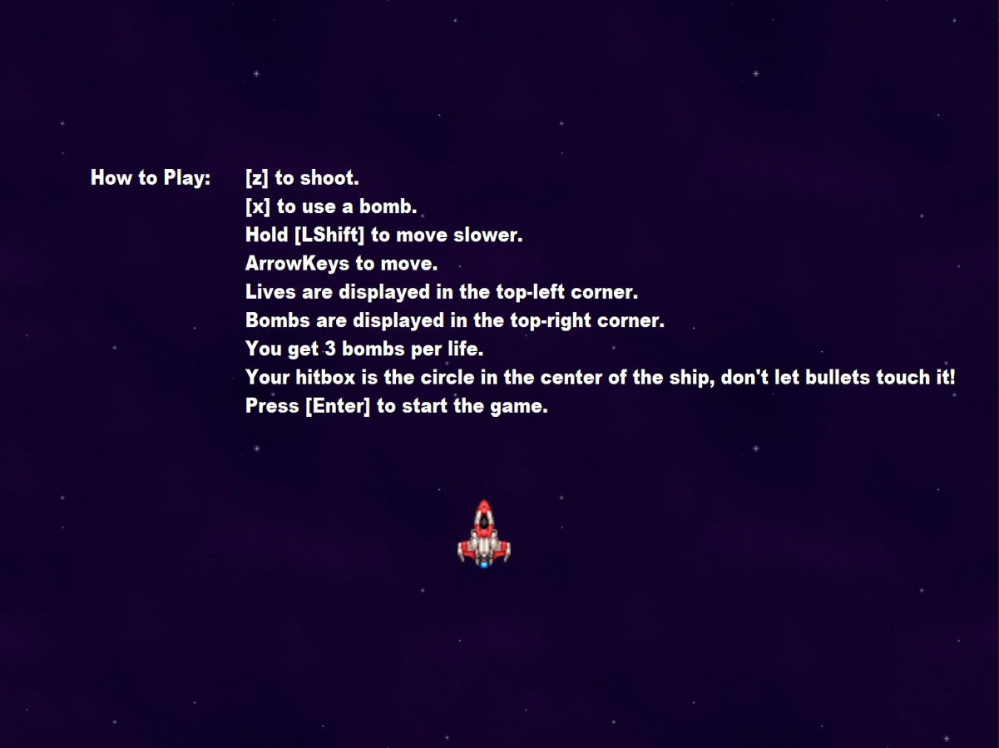

# 2D-Shooter-Game
My first game developed in 2018. A top-down 2D shooter game with its own engine developed in C++ with the SFML library. The player controls a space ship and will be attacked by alien enemies. The player can shoot at the enemies and can use bombs to destroy all of the bullets on the screen to buy time. At the end of the level there is a final boss. 

# How to play

# Gameplay Video
https://youtu.be/Zs19emf-nwE

# Windows Installation
1. Download the Game.zip file
2. Unzip Game.zip
3. Open the folder and run the game.exe file
